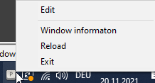
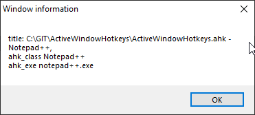

# ActiveWindowHotkeys
Windows application that makes the same hotkey trigger a unique action for the current window

## Installation
Run ActiveWindowHotkeys.exe

## Configuration
Open Hotkeys.ahk in a text editor

---
### Global hotkeys
Global hotkeys are defined between
> ; ALL WINDOWS START

and

> ; ALL WINDOWS END

The default hotkey to show the Help is `F10` 
There is also a global hotkey `F9` to move the mouse cursor to the center of the current window.

---

### Hotkeys for a specific window 
Hotkeys that work on a specific window are defined this way

1.  Find the name of the window 

    Note that you just need the part of the window title that stays the same.       
    For example chrome and firefox always add "- Browsername" at the end of the window title. Examples "- Google Chrome" and "- Mozilla Firefox"

2. add a new section to Hotkeys.ahk

    ```#IfWinActive, Mozilla Firefox```

3. add a description for the help 

    ``` ; Firefox Hotkeys ```

4. add your hotkeys, for example you want alt and r to trigger F5 in firefox

    ```
    !r::
    ; Reload page
        Send, F5
    return

5. restart ActiveWindowHotkeys.exe

---

### How do I find out the syntax for the hotkeys?
This application is based on [Autohotkey](https://www.autohotkey.com).

You can find the documentation for the hotkey syntax here: 

[Autohotkey Hotkeys](https://www.autohotkey.com/docs/Hotkeys.htm)

#### Most important hotkeys

**\# = winkey**

Example
Windows + b to show bookmarks in chrome

```
#b::
; open bookmarks
    Send, ^+o
return
```

---

**! = alt**

Example
alt + s to open a new window in chrome

```
!s::
; open a new window
    Send, ^n
return
```

**+ = shift**

Example
shift + 1 to open a new tab in chrome
```
+1::
; open a new tab
    Send, ^t
return
```

---
You can combine all those hotkeys.

Example
winkey aand shift and x to open cache settings in chrome
```
#+x::
; open cache settings
    Send, ^+{Del}
return
```

---
### What can I send with the `send` command?
Have a look at the autohotkey documentation

[Autohotkey Send](https://www.autohotkey.com/docs/commands/Send.htm)

### Are there other ways than the window title to assign hotkeys for a specific window
Yes, you can also use the class of the window.

To create a hotkey for the windows file explorer to create a new folder with ctrl and n you could do this
```
#IfWinActive, ahk_class CabinetWClass
^n::
; new folder
	Send, ^+n
return
```

### How to find the class of the window
Use the try icon menu entry "Window information"



After selecting it click the window you want to get the information from.
A message box will open.

When you close the message box the information will be copied to your clipboard

Example notepad++



You can then use this information for your hotkeys.

* using the title* 

```
#IfWinActive, - Notepad++
; Notepad++
^Right::
; ctrl and right arrow to go to the next tab
	Send, ^{PgDn}
return
```

* using the ahk_class* 

```
#IfWinActive, ahk_class Notepad++
; Notepad++
^Right::
; ctrl and right arrow to go to the next tab
	Send, ^{PgDn}
return
```

* using the ahk_exe* 

```
#IfWinActive, ahk_exe notepad++.exe
; Notepad++
^Right::
; ctrl and right arrow to go to the next tab
	Send, ^{PgDn}
return
```